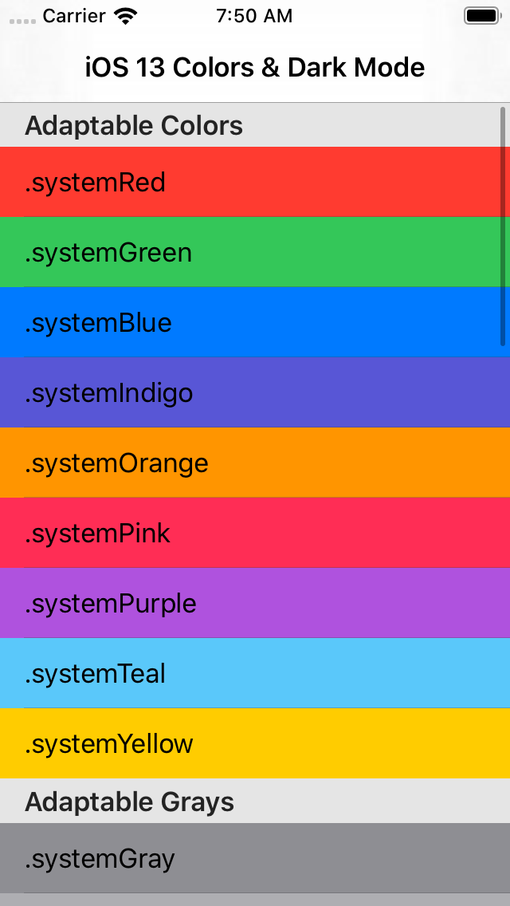
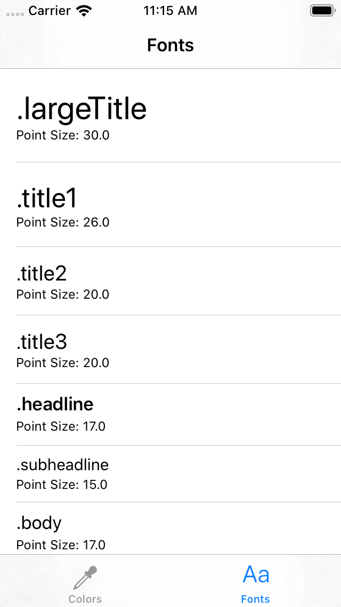
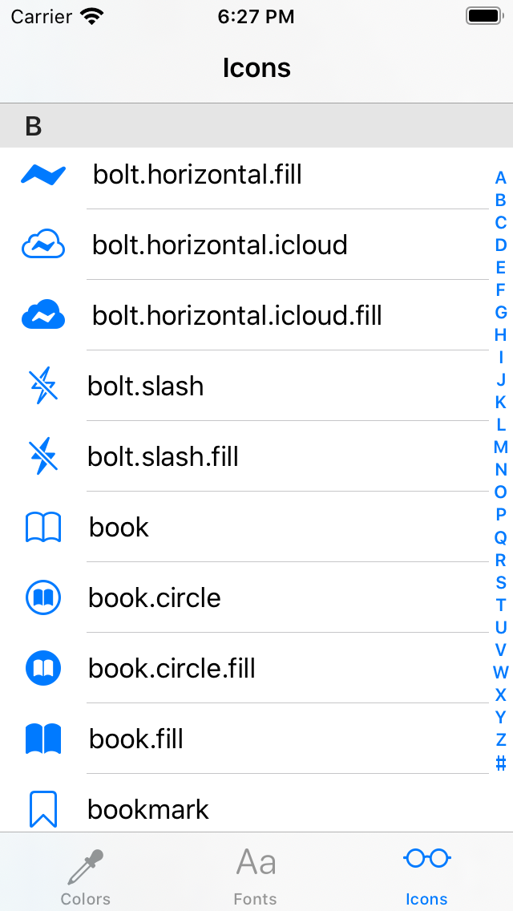

# iOS Semantic UI: Dark Mode, Dynamic Type, and SF Symbols

This sample project makes it easy to visualize all of iOS's semantic and adaptable colors, preferred fonts for text styles, and built-in icons.

Semantic colors automatically adapt to system settings, like Dark Mode, to give your app a UI that is always legible.

Semantic fonts are used in Dynamic Type to make sure that your font sizes always scale with to meet the user's needs.

SF Symbols is an icon font that gives you and your apps access to over 1,000 Apple designer-created icons.

## Light Mode

## Dark Mode

## Fonts

## SF Symbols

# Colors

## Adaptable Colors

Some colors are used by system elements and applications. These return named colors whose values may vary between different contexts and releases. Do not make assumptions about the color spaces or actual colors used.

* `.systemRed`
* `.systemGreen`
* `.systemBlue`
* `.systemIndigo`
* `.systemOrange`
* `.systemPink`
* `.systemPurple`
* `.systemTeal`
* `.systemYellow`

## Adaptable Grays

Shades of gray. `systemGray` is the base gray color. The numbered variations, `systemGray2` through `systemGray6`, are grays which increasingly trend away from `systemGray` and in the direction of `systemBackgroundColor`.

In `UIUserInterfaceStyleLight`: `systemGray1` is slightly lighter than `systemGray`. `systemGray2` is lighter than that, and so on.

In `UIUserInterfaceStyleDark`:  `systemGray1` is slightly darker than `systemGray`. `systemGray2` is darker than that, and so on.

* `.systemGray`
* `.systemGray2`
* `.systemGray3`
* `.systemGray4`
* `.systemGray5`
* `.systemGray6`

## Label Colors

Foreground colors for static text and related elements.

* `.label`
* `.secondaryLabel`
* `.tertiaryLabel`
* `.quaternaryLabel`

## Text Colors

Foreground color for placeholder text in controls or text fields or text views.

* `.placeholderText`

## Link Color

Foreground color for standard system links.

* `.link`

## Separators

Foreground colors for separators (thin border or divider lines). `separatorColor` may be partially transparent, so it can go on top of any content. `opaqueSeparatorColor` is intended to look similar, but is guaranteed to be opaque, so it will completely cover anything behind it. Depending on the situation, you may need one or the other.

* `.separator`
* `.opaqueSeparator`

## Fill Colors

Fill colors for UI elements. These are meant to be used over the background colors, since their alpha component is less than 1.

`systemFillColor` is appropriate for filling thin and small shapes. Example: The track of a slider.

`secondarySystemFillColor` is appropriate for filling medium-size shapes. Example: The background of a switch.

`tertiarySystemFillColor` is appropriate for filling large shapes. Examples: Input fields, search bars, buttons.

`quaternarySystemFillColor` is appropriate for filling large areas containing complex content. Example: Expanded table cells.

* `.systemFill`
* `.secondarySystemFill`
* `.tertiarySystemFill`
* `.quaternarySystemFill`

## Background Colors

We provide two design systems (also known as "stacks") for structuring an iOS app's backgrounds. Each stack has three "levels" of background colors. The first color is intended to be the main background, farthest back. Secondary and tertiary colors are layered on top of the main background, when appropriate.

Inside of a discrete piece of UI, choose a stack, then use colors from that stack. We do not recommend mixing and matching background colors between stacks. The foreground colors above are designed to work in both stacks.

Stack 1: `systemBackground` -  Use this stack for views with standard table views, and designs which have a white primary background in light mode.

* `.systemBackground`
* `.secondarySystemBackground`
* `.tertiarySystemBackground`

## Grouped Background Colors

Stack 2: `systemGroupedBackground` - Use this stack for views with grouped content, such as grouped tables and platter-based designs. These are like grouped table views, but you may use these colors in places where a table view wouldn't make sense.

* `.systemGroupedBackground`
* `.secondarySystemGroupedBackground`
* `.tertiarySystemGroupedBackground`

## Non-Adaptable Colors

`lightTextColor` is always light, and `darkTextColor` is always dark, regardless of the current `UIUserInterfaceStyle`. When possible, we recommend using `labelColor` and its variants, instead.

* `.lightText`
* `.darkText`

# Fonts

Font text styles, semantic descriptions of the intended use for a font returned by `UIFont.preferredFont(forTextStyle:)`.

* `.largeTitle`
* `.title1`
* `.title2`
* `.title3`
* `.headline`
* `.subheadline`
* `.body` 
* `.callout`
* `.footnote`
* `.caption1`
* `.caption2`

# Icons (SF Symbols)

[SF Symbols](https://developer.apple.com/design/human-interface-guidelines/sf-symbols/overview/) provides a set of thousands of consistent, highly configurable symbols you can use in your app. Apple designed SF Symbols to integrate seamlessly with the San Francisco system font, so the symbols automatically ensure optical vertical alignment with text for all weights and sizes.

# Contributors

* [Aaron Brethorst](https://github.com/aaronbrethorst)
* [Nicolas Garcia](https://github.com/nicoonguitar)
* [Dan Turner](https://github.com/djtech42)
* [Duncan Horne](https://github.com/Zem0)
* [Renz](https://github.com/rhenz)
* [JinSeok Yang](https://github.com/DanielY1108)

# Third Party Libraries

## SFSymbols Library

https://github.com/Rspoon3/SFSymbols

    MIT License

    Copyright (c) 2021 Richard Witherspoon

    Permission is hereby granted, free of charge, to any person obtaining a copy
    of this software and associated documentation files (the "Software"), to deal
    in the Software without restriction, including without limitation the rights
    to use, copy, modify, merge, publish, distribute, sublicense, and/or sell
    copies of the Software, and to permit persons to whom the Software is
    furnished to do so, subject to the following conditions:

    The above copyright notice and this permission notice shall be included in all
    copies or substantial portions of the Software.

    THE SOFTWARE IS PROVIDED "AS IS", WITHOUT WARRANTY OF ANY KIND, EXPRESS OR
    IMPLIED, INCLUDING BUT NOT LIMITED TO THE WARRANTIES OF MERCHANTABILITY,
    FITNESS FOR A PARTICULAR PURPOSE AND NONINFRINGEMENT. IN NO EVENT SHALL THE
    AUTHORS OR COPYRIGHT HOLDERS BE LIABLE FOR ANY CLAIM, DAMAGES OR OTHER
    LIABILITY, WHETHER IN AN ACTION OF CONTRACT, TORT OR OTHERWISE, ARISING FROM,
    OUT OF OR IN CONNECTION WITH THE SOFTWARE OR THE USE OR OTHER DEALINGS IN THE
    SOFTWARE.

# License

Color names, fonts, icons, and descriptive text (c) Apple Inc. All code in this repository is:

    MIT License

    Copyright (c) 2019 Aaron Brethorst

    Permission is hereby granted, free of charge, to any person obtaining a copy
    of this software and associated documentation files (the "Software"), to deal
    in the Software without restriction, including without limitation the rights
    to use, copy, modify, merge, publish, distribute, sublicense, and/or sell
    copies of the Software, and to permit persons to whom the Software is
    furnished to do so, subject to the following conditions:

    The above copyright notice and this permission notice shall be included in all
    copies or substantial portions of the Software.

    THE SOFTWARE IS PROVIDED "AS IS", WITHOUT WARRANTY OF ANY KIND, EXPRESS OR
    IMPLIED, INCLUDING BUT NOT LIMITED TO THE WARRANTIES OF MERCHANTABILITY,
    FITNESS FOR A PARTICULAR PURPOSE AND NONINFRINGEMENT. IN NO EVENT SHALL THE
    AUTHORS OR COPYRIGHT HOLDERS BE LIABLE FOR ANY CLAIM, DAMAGES OR OTHER
    LIABILITY, WHETHER IN AN ACTION OF CONTRACT, TORT OR OTHERWISE, ARISING FROM,
    OUT OF OR IN CONNECTION WITH THE SOFTWARE OR THE USE OR OTHER DEALINGS IN THE
    SOFTWARE.
